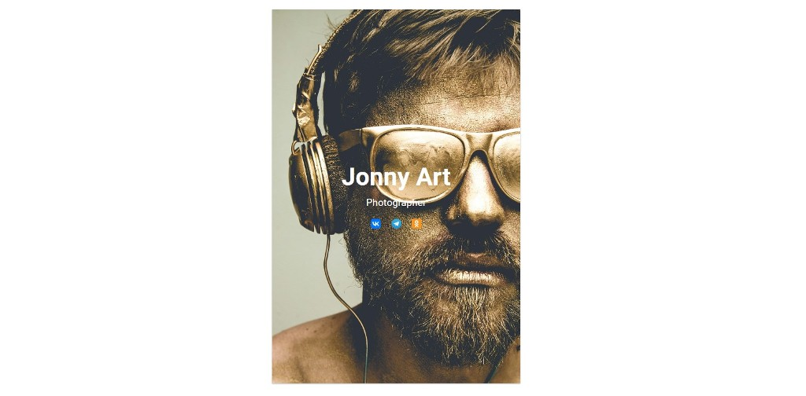
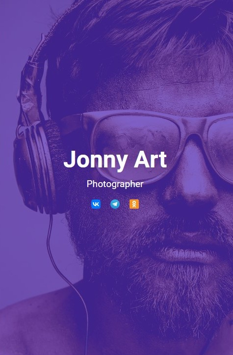
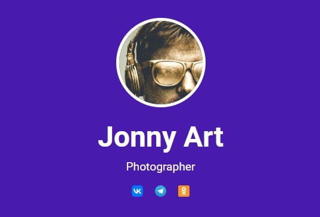

Условие задачи
Заказы от фотографов продолжают поступать. Поэтому вы решили создать сайт, на котором каждый фотограф сможет разместить свое портфолио. Информация о каждом из фотографов будет представлена в виде карточек с контактными данными. Сейчас при всех разрешениях экрана такая карточка выглядит одинаково:

https://netology-code.github.io/mq-simulator/adaptive-layout/user-card/sources/adaptive-layout-card-current.jpg

Нужно изменить верстку таким образом, чтобы на устройствах с шириной экрана от 767px и меньше или от 1301px и больше карточка выглядела так:

https://netology-code.github.io/mq-simulator/adaptive-layout/user-card/sources/adaptive-layout-card-target.jpg

А на устройствах с шириной экрана в диапазоне от 768px до 1300pxвключительно — так:

https://netology-code.github.io/mq-simulator/adaptive-layout/user-card/sources/adaptive-layout-card-ipad.jpg

Реализация
Внесите изменения в файле card.css

Процесс реализации
Для элемента с классом profile__preview:before добавить прозрачность 0.7 и цвет фона #481bae только для устройств, у которых ширина экрана от 767px и меньше или от 1301px и больше.
Для элемента с классом profile добавить цвет фона #481bae только для устройств, у которых ширина экрана в диапазоне от 768px до 1300px включительно.
Для элемента с классом profile__preview добавить ширину и высоту по 140px, сплошную рамку цветом #ffffff и шириной 5px только для устройств, у которых ширина экрана в диапазоне от 768px до 1300px включительно.
Закруглить углы у элемента с классом profile__preview только для устройств, у которых ширина экрана в диапазоне от 768px до 1300px включительно.

Подсказка:
Для закругление углов используйте border-radius: 50%;